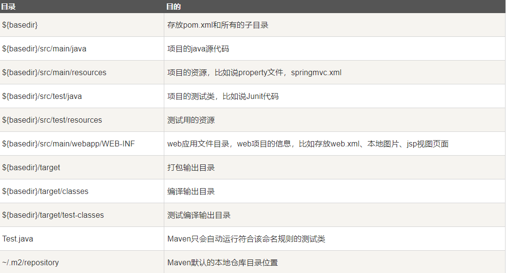

# Maven
基于Java的攻击，使用POM (Project Object Model基于项目对象模型)，管理项目的构建，报告和文档等步骤。(需配置JDK和环境变量)

### 功能
- 构建
- 文档生成
- 报告
- 依赖
- SCMs
- 发布
- 分发
- 邮件列表

### 目录介绍


### POM配置内容
- 项目依赖
- 插件
- 执行目标
- 项目构建 profile
- 项目版本
- 项目开发者列表
- 相关邮件列表信息

```
    <!-- 模型版本 -->
    <modelVersion>4.0.0</modelVersion>

    <!-- 公司或者组织的唯一标志，并且配置时生成的路径也是由此生成，maven会将该项目打成的jar包放本地 -->
    <groupId></groupId>
 
    <!-- 项目的唯一ID，一个groupId下面可能多个项目，就是靠artifactId来区分的 -->
    <artifactId>project</artifactId>

    <!-- 版本号 -->
    <version>1.0</version>

    <!-- 构建类型-->
    <packaging>pom</packaging>

    <!--项目的名称, Maven产生的文档用 -->
    <name>banseon-maven</name>

    <!--项目主页的URL, Maven产生的文档用 -->
    <url>http://www.baidu.com/banseon</url>

    <!-- 项目的详细描述, Maven 产生的文档用。 -->
    <description>A maven project to study maven.</description>
</project>
```

### 继承式
父（Super）POM是 Maven 默认的 POM。所有的 POM 都继承自一个父 POM（无论是否显式定义了这个父 POM）。管理所有的***版本**依赖，以后导入的时候就不需要写版本了。
```
 <parent>
        <!--被继承的父项目的构件标识符 -->
        <artifactId />
        <!--被继承的父项目的全球唯一标识符 -->
        <groupId />
        <!--被继承的父项目的版本 -->
        <version />
        <!-- 父项目的pom.xml文件的相对路径。相对路径允许你选择一个不同的路径。默认值是../pom.xml。Maven
            首先在构建当前项目的地方寻找父项 目的pom，其次在文件系统的这个位置（relativePath位置），然后
            在本地仓库，最后在远程仓库寻找父项目的pom。 -->
        <relativePath />
    </parent>
```

详细见[菜鸟教程](http://www.runoob.com/maven/maven-pom.html)

---

### Maven生命周期 (Lifecycle)
- clean 清理
- validate 验证
- compile 编译
- test 测试
- package 打包
- verify 检查，对集成测试的结果检查，保证质量
- install 安装
- deploy 部署
- default(或build) 项目部署的处理
- site 项目站点文档创建的处理

### Clean生命周期
**前中后**
- pre-clean：执行一些需要在clean之前完成的工作
- clean：移除所有上一次构建生成的文件
- post-clean：执行一些需要在clean之后立刻完成的工作

---

### 命令行调用
```
mvn validate
mvn install
...
...
mvn clean
mvn deploy
```

### 修改Maven仓库
第一，修改**conf/setting.xml**文件
```
<mirrors>
    <mirror>
      <id>alimaven</id>
      <name>aliyun maven</name>
      <url>http://maven.aliyun.com/nexus/content/groups/public/</url>
      <mirrorOf>central</mirrorOf>        
    </mirror>
</mirrors>
```

第二，修改pom.xml
```
<repositories>  
        <repository>  
            <id>alimaven</id>  
            <name>aliyun maven</name>  
            <url>http://maven.aliyun.com/nexus/content/groups/public/</url>  
            <releases>  
                <enabled>true</enabled>  
            </releases>  
            <snapshots>  
                <enabled>false</enabled>  
            </snapshots>  
        </repository>  
</repositories>
```

---

### 引入依赖
```
<dependencies>
    <!-- 在这里添加你的依赖 -->
    <dependency>
        <groupId>ldapjdk</groupId>  <!-- 库名称，也可以自定义 -->
        <artifactId>ldapjdk</artifactId>    <!--库名称，也可以自定义-->
        <version>1.0</version> <!--版本号-->
        <scope>system</scope> <!--作用域-->
        <systemPath>${basedir}\src\lib\ldapjdk.jar</systemPath> <!--项目根目录下的lib文件夹下-->
    </dependency> 
</dependencies>
```

### 插件
```
<build>
<plugins>
   <plugin>
   <groupId>org.apache.maven.plugins</groupId>
   <artifactId>maven-antrun-plugin</artifactId>
   <version>1.1</version>
   <executions>
      <execution>
         <id>id.clean</id>
         <phase>clean</phase>
         <goals>
            <goal>run</goal>
         </goals>
         <configuration>
            <tasks>
               <echo>clean phase</echo>
            </tasks>
         </configuration>
      </execution>     
   </executions>
   </plugin>
</plugins>
</build>
```

