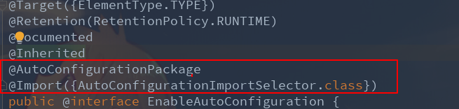
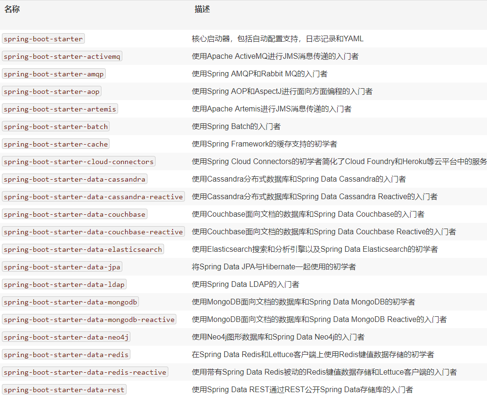

# Spring Boot

基于java的开源框架，减少了人工去配置xml文件，便于快速搭建SpringWeb，用于创建微服务 (micro service)，自动配置嵌入式Tomcat。

详细请参考[官方文档](https://docs.spring.io/spring-boot/docs/2.0.5.RELEASE/reference/htmlsingle/#getting-started-first-application-dependencies)

[TOC]

## 一、Spring Boot入门

### Spring Boot工作原理

#### @SpringBootApplication

​	程序入口，包含了以下等内容：@Configuration、@EnableAutoconfiguration、@ComponentScan、@SpringBootConfiguration等

#### `@Configuration` 

​	标记该类作为应用程序上下文的bean定义的来源。

#### @EnableAutoconfiguration

​	能够自动注入项目中的**依赖**



#### @ComponentScan

​	自动扫描项目中的**组件**

#### @AutoConfigurationPackage

​	自动配置包 (注：@SpringBootApplication默认是将配置类所在的包及其子包的所有组件扫描到Spring容器)

### Spring Boot Starters启动器

Spring Boot Starters启动器用于解决依赖问题，开发**不同场景的项目**选择不同的依赖。具体参考官方文档[**表13.1。Spring Boot应用程序启动器**](https://docs.spring.io/spring-boot/docs/2.0.5.RELEASE/reference/htmlsingle/#using-boot-starter)。下面的截图列出了一部分，使用的是chrome翻译，对于翻译的准确性不做保证.



#### @RestController

​	用于Spring MVC处理WEB请求，@Controller`和`@ResponseBody的组合

#### @RequestMapping

​	**返回纯文本**，@RestController`**返回数据**而**不是视图。**

#### @Bean

​	给容器添加一个组件，将方法的返回值添加到容器中，并且方法名就是id

#### Spring Boot运行器


​	应用程序运行器(Runner)和命令行Runner接口允许在Spring Boot应用程序启动后执行代码。可以使用这些接口在应用程序启动后立即执行一些操作。 如ApplicationRunner 和CommandLineRunner 接口。
### 打包

1. 打包成jar

*pom.xml*配置插件

```
<build>
    <plugins>
        <plugin>
            <groupId>org.springframework.boot</groupId>
            <artifactId>spring-boot-maven-plugin</artifactId>
        </plugin>
    </plugins>
</build>
```

2. 打包成jar并运行

```
mvn package && java -jar target / spring-boot-0.1.0.jar
```

### 快速创建

- IDEA——New Project——Sprign Initializr

- 文件说明:

  - staitc: 静态资源

  - templates：保存所有的模板页面

  - application.properties: **spring配置文件**，可直接修改，IDEA会提示

  - **application.yml: **Spring配置文件的另一种格式。Spring Boot支持基于YAML的属性配置来运行应用程序。可以使用application.yml文件代替application.properties。

    ```yml
    server:
    	port: 4000
    ```

## 二、YAML

#### YAML简介

YAML是"YAML Ain't a Markup Language"（YAML不是一种标记语言）的递归缩写。**以数据做为中心**

#### YAML基本语法

- 严格缩进

- 不允许使用**Tab键**，只能用空格。

- 空格数不重要，但是要对齐。

- 大小写敏感

- #表示注释

- 数据结构：key-Value（支持单行写法和多行写法, 又称行内写法和多行写法）

  - 对象：mapping / hashes / dictionary

    ```yaml
    server: mio
    	name: foo
    	age: bar
    # 另一种写法
    server: {name: foo, age: bar}
    ```

  - 数组：sequence / list

    ```yaml
    list:
    	- list1
    	- list2
    # 另一种写法
    list: [list1, list2]
    ```

  - 纯量：scalars

    - 字符串

      - 默认不使用引号
      - 使用单引号 **''**，**会转义**
      - 使用双引号**""**，**不会转义**

      ```yaml
      
      ```

    - 布尔值

      ```yaml
      isRed: true
      使用true和false
      ```

    - 整数

      ```yaml
      number: 1314
      ```

    - 浮点数

      ```yaml
      number: 13.14
      ```

    - Null

      ```yaml
      parent: ~
      比较特殊的表示，使用~符合
      ```

    - 时间

      ```yaml
      iso8601: 2001-12-14t21:59:43.10-05:00
      使用ISO8601 格式
      ```

    - 日期

      ```yaml
      date: 2019-03-14
      采用复合 iso8601 格式
      ```

  - 数据转换

  使用两个感叹号

  ```yaml
  a: !!str 123
  ```

  多行字符串可以使用 `|` 保留换行符，也可以使用 `>` 折叠换行

  `+`表示保留文字块末尾的换行，`-`表示删除字符串末尾的换行

  引用：建立锚点&，引用锚点*，<<合并到当前数据

  ```yaml
  defaults: &defaults
    adapter:  postgres
    host:     localhost
  
  development:
    database: myapp_development
    <<: *defaults
  
  ```

- 例子

  ```yaml
  person:
    name: Akane
    age: 233
    birth: 2019/03/14
    girlFriend: true
    map: {k1: v1, k2: 2}
    list:
      - eat
      - shop
    girl:
      name: YTing
      age: 18
  ```

## 三、Spring Boot配置文件

application.properties为Spring Boot的配置文件，里面包含了spring的很多配置信息，可以在这里直接修改配置信息。里面能够配置的信息，来源于properties类

#### 从application.yml或application.properties读取属性值自动配置注入

- 在pom.xml中配置处理器

- IDEA——Enalbe annotation processing
- 配置bean```@ConfigurationProperties(prefix = "person")```
- 配置applicatjon.yml
- 单元测试

解决properties乱码问题：

```
Settings——File encodings——Transparent native-to-ascii conversion
```

#### 配置多个Profile文件

可以创建多个配置文件，不同的生产环境选择不同的配置文件。默认使用application.properties


示例如下：

方法一：使用application.properties的形式

```properties
spring.profiles.active=dev
```


方法二：YAML文件使用文档块的模式的形式

```yml
server:
  port: 8080
spring:
  profiles: 
    active: test # 激活
# ---表示文档块模式
---
server:
  port: 4000
spring:
  profiles: production

---
server:
  port: 9999
spring:
  profiles: test
```

方法三：

其实在IDEA中有很好的支持显示， 手动选择即可


方法四：

用命令行的方式，优先级最高

```
java -jar /xxx.jar --spring.profiles.active= 
```


#### spring.config.location=——Spring Boot配置文件的加载顺序

```
# 注: file:./为application.properties所在的目录
file:./config/
file:./
# 注： classpath:./为项目的根路径，即项目名所在的路径
classpath:./config/
classpath:./
优先级由高到低，高优先级的会覆盖低的
```

当然，你也可以手动设置

```xml
spring.config.location=
```


---


#### @Value("")与@ConfigurationProperties(prefix = "")的比较

@Value标注在属性上，@ConfigurationProperties标注在类上并且批量注入

|                |              |                                       |
| -------------- | ------------ | ------------------------------------- |
|                | Value("")    | @ConfigurationProperties(prefix = "") |
| 功能           | 一个一个指定 | 批量                                  |
| 松散绑定       | 不支持       | 支持                                  |
| SpEL           | 支持         | 不支持                                |
| JSR303数据校验 | 不支持       | 支持                                  |
| 复杂类型封装   | 不支持       | 支持                                  |

```java
//@Value("${person.name}")
private String name;
// JSR303数据校验
@Email
private String email;
@Value("#{10*10}")
private Integer age;
```

#### @PropertySource()与@ImportResource

@PropertySource(): 加载指定的配置文件

```
@PropertySource(value = "classpath:person.properties")
@Component // 添加到组件中
@ConfigurationProperties(prefix = "person")
public class Person {
```

@ImportResource: 导入Spring配置文件，让配置文件内容生效。(Spring Boot没有spring 配置文件，我们自己写的也不自动导入)

```java
@ImportResource(locations = "classpath:")
@SpringBootApplication
public class SpringdemoApplication implements ApplicationRunner {	
```

SpringBoot推荐做法

```java
// 标明是一个配置类
@Configuration
public class MyAppConfig {

    /**
     * 将方法的返回值添加到容器中，并且方法名就是id
     */
    @Bean
    public HelloService helloService() {
        return new HelloService();
    }
}

```

#### 配置文件占位符

在application.properties文件中配置

```properties
person.age=${random.int} # 随机数
person.name=Akane${person.age} #占位符
person.name=Akane${person.hello:hello} #如果没有可以使用:指定默认值
```

#### @Conditionnal派生注解

**自动配置类必须在一定的条件下才能生效**

```properties
# 在application.properties可以用debug属性，用于查看哪些自动配置类生效
debug=true
```

conditionnal: 有条件的

prefix: 前缀，字首

#### 重点


## 四、Spring Boot构建RESTful Web服务

1. 配置*pom.xml*，添加*spring-boot-starter-web*启动器

#### @RestController——Rest控制器

​	作用：定义RESTful Web服务，@Controller`和`@ResponseBody的组合

#### @RequestMapping——请求映射

​	作用：用于定义访问REST端点的Request URI

```java
RequestMapping(value = "/getNotice", method = RequestMethod.GET)
```

#### @RequestBody——请求主体

​	作用：用于定义请求返回的内容类型

#### @PathVariable——路径变量

​	作用：用于定义自定义或动态请求URI。 请求URI中的Path变量定义为花括号`{}`

```java
    @RequestMapping("/{name}")
    public String index(@PathVariable("name") String name) {
        return "Hello ! " + name;
    }
```

#### @RequestParam——请求参数

​	作用：用于从请求URL读取请求参数

```java
@RequestMapping(value = "/upLoadAvatar", method = RequestMethod.POST)
	public String uploadAvatarImg(@RequestParam(value = "id") Integer id,
			@RequestParam(value = "upload-avatar") MultipartFile avatarFile, HttpServletRequest request) {
```

#### HTTP请求方法

GET API: 默认.  method = RequestMethod.GET

POST API:  用于创建资源.  method = RequestMethod.POST

PUT API: 用于更新现有资源.  method = RequestMethod.PUT

DELETE API: 用于删除现有资源. method = RequestMethod.DELETE


## 五、Spring Boot Log

Spring Boot使用Apache Commons日志记录进行所有内部日志记录。默认打印在控制台，存在日志到文件可以通过*logging.file* 或*logging.path* 设置

```xml
logging.path=/user/local/log
logging.level.com.favorites=DEBUG
logging.level.com.example=TRACE # 设置日志级别
logging.level.org.springframework.web=INFO
logging.level.org.hibernate=ERROR
logging.pattern.console= # 设置控制台显示的格式
logging.pattern.file= # 设置保存文件的显示格式
```

- 提供日志日期和时间的日期和时间。

- 日志级别显示有：INFO，ERROR或WARN。

- 进程ID。

- `---`是一个分隔符。

- 线程名称括在方括号`[]`中。

- 记录器名称，显示源类名称。

- 日志消息。

  ```
  2019-03-14 17:16:02.001  INFO 11376 --- [nio-8080-exec-1] o.s.web.servlet.DispatcherServlet        : Completed initialization in 4 ms
  ```

SpringBoot日志使用和级别

注: SpringBoot默认输出的是Info级别，如需要修改则到application.properties修改。


#### 日志框架

Spring Boot的默认配置支持使用Java Util Logging，Log4j2和Logback。

**1. 开发中使用SFL4J**

```java
import org.slf4j.Logger;
import org.slf4j.LoggerFactory;

public class HelloWorld {
  public static void main(String[] args) {
    Logger logger = LoggerFactory.getLogger(HelloWorld.class);
    logger.info("Hello World");
  }
}
```

2. 导包


3. 编写配置文件

---


#### SpringBoot日志依赖关系


#### 自定义日志配置


logback.xml：直接被日志框架识别

**logback-spring.xml**：不直接别识别，由SpringBoot解析日志配置，可以使用SpringBoot的高级profile功能


